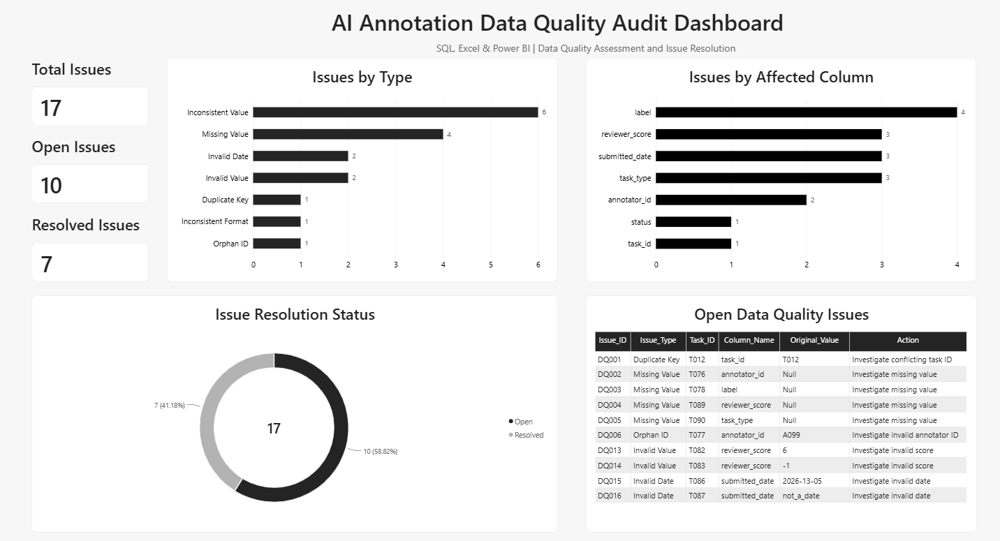

# AI Annotation Data Quality Audit

A portfolio project using synthetic AI annotation data to demonstrate data quality auditing, cleaning, validation, and reporting using SQL, Excel, and Power BI.

> **Data Privacy Note:** This project uses a fully synthetic dataset created solely for portfolio and learning purposes. It does not contain any confidential, proprietary, client, or real production annotation data.

## Project Objective

The objective of this project is to simulate a practical AI annotation data quality workflow by:

- identifying data quality issues using SQL
- documenting and cleaning issues in Excel
- tracking issue resolution using an Issue Log
- validating cleaned data using Excel and SQL re-validation
- visualizing audit findings in Power BI

## Dataset Overview

This project uses a synthetic AI annotation dataset containing:

- 91 annotation records
- 15 annotators
- annotation task types such as Data Annotation, Response Evaluation, Search Relevance, and Transcription
- reviewer scores, task status, labels, and submission dates

The dataset was intentionally designed with data quality issues to simulate a realistic audit and cleaning workflow.

## Tools Used

- **SQL (SQLite / DB Browser for SQLite)** — data auditing, duplicate detection, missing-value checks, orphan ID validation, consistency checks, and post-cleaning re-validation
- **Microsoft Excel** — issue logging, manual cleaning, helper columns, and validation checks
- **Power BI** — visualization of data quality findings, issue status, affected columns, and unresolved issues

## Project Workflow

1. Imported the raw annotation and annotator datasets into SQLite.
2. Performed SQL data quality checks for duplicates, missing values, orphan IDs, inconsistent categories, invalid reviewer scores, and date issues.
3. Documented all detected issues in an Excel Issue Log.
4. Cleaned issues that could be safely standardized without guessing unknown values.
5. Performed Excel validation checks to confirm the cleaning results.
6. Exported the cleaned dataset and re-imported it into SQLite.
7. Re-ran SQL validation queries to verify resolved and unresolved issues.
8. Built a Power BI dashboard to summarize data quality findings and issue resolution status.

## Key Findings

- 17 data quality issues were identified across the annotation dataset.
- 7 issues were resolved through safe standardization and cleaning.
- 10 issues remained open because they required source verification rather than assumptions.
- Inconsistent values were the most common issue type, with 6 cases detected.
- The `label` column had the highest number of detected issues, with 4 cases.
- Remaining unresolved issues included missing values, an orphan annotator ID, invalid reviewer scores, invalid dates, and a duplicate task ID.
- SQL re-validation confirmed that cleaned label, task type, status, and date-format issues were successfully resolved.

## Power BI Dashboard

The Power BI dashboard summarizes the main audit results, including:

- Total Data Quality Issues
- Open Issues
- Resolved Issues
- Issues by Type
- Issues by Affected Column
- Issue Resolution Status
- Detailed Open Data Quality Issues

The dashboard is designed to provide a clear view of dataset quality, issue distribution, and unresolved records that require further investigation.

## Project Files

- `annotations.csv` — synthetic raw annotation dataset
- `annotators.csv` — synthetic annotator reference dataset
- `annotations_cleaned.csv` — cleaned annotation dataset used for re-validation
- `data_quality_audit.sql` — SQL audit and post-cleaning re-validation queries
- `AI_Annotation_Data_Quality_Audit_Working.xlsx` — Excel workbook containing the Issue Log, cleaned data, helper checks, and validation results
- `AI_Annotation_Data_Quality_Audit.pbix` — Power BI dashboard file
- `powerbi_data_quality_dashboard.png` — final dashboard preview

## Skills Demonstrated

- SQL data quality auditing and validation
- Duplicate and missing-value detection
- Referential integrity checks using joins
- Categorical consistency validation
- Data cleaning and issue tracking in Excel
- Excel formulas including COUNTIF, COUNTIFS, COUNTBLANK, and helper columns
- Post-cleaning SQL re-validation
- Power BI dashboard development
- Data quality reporting and issue resolution tracking
- Working with synthetic AI annotation data in a privacy-safe portfolio environment

## Dashboard Preview

